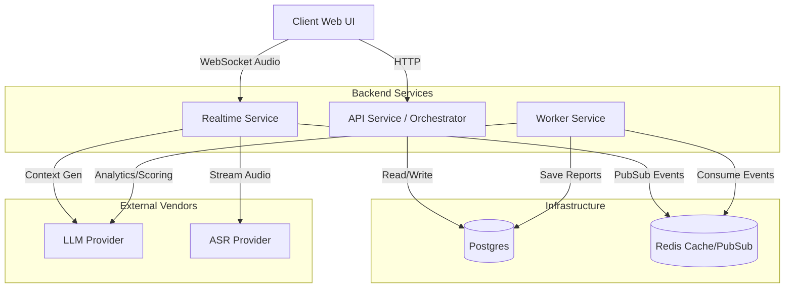

# System Architecture

**Status:** Draft (v1)
**Maintainer:** Nabin Oli

## Overview
Interview Agent is an AI copilot designed to assist, not replace—human recruiters. The system captures live audio, transcribes it in real-time, generates context-aware prompts, and produces evidence-based scoring reports.

### Key Architectural Goals
1.  **Latency Sensitive:** Real-time prompts must appear within seconds of the candidate speaking.
2.  **Vendor Agnostic:** We must be able to swap LLMs (e.g., GPT-4o to Claude 3.5) or ASR providers (Deepgram to Whisper) without rewriting core logic.
3.  **Auditability:** Every AI suggestion or score must be traceable back to a specific segment of the transcript.

## 2. High-Level Diagram

## Design Principles

* **AI is Advisory:** The system output is a suggestion, never a command.
* **Uncertainty is Valid:** If the AI is unsure, it should output "Insufficient Data" rather than hallucinating a score.
* **Pure Core:** The `core/` folder should not know about HTTP requests or databases. This makes unit testing the business logic incredibly fast.

